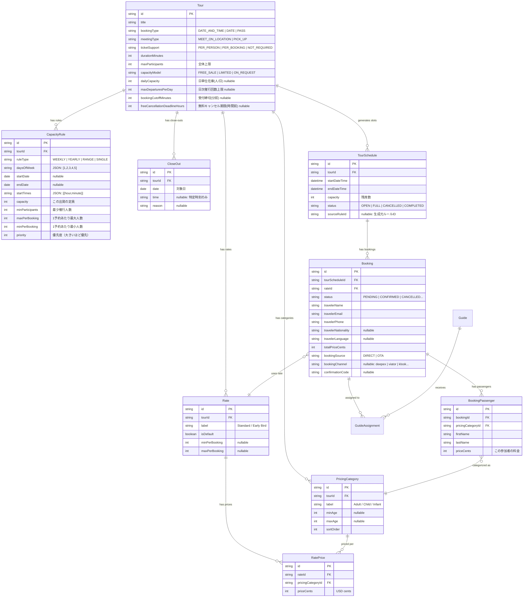
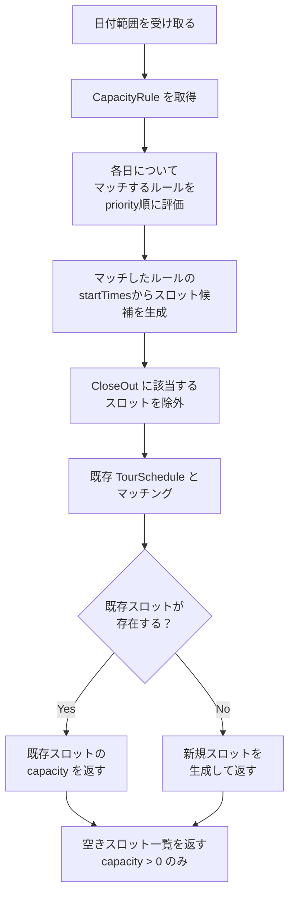

# 空き枠・料金モデル設計

## 1. 概要

本ドキュメントは、DeepExperienceの空き枠（Availability）管理と料金（Pricing）モデルの完成形仕様を定義する。Bokun Channel Manager API互換を前提とし、将来の独自Hub化にも対応できる設計とする。

### 設計方針

- **Positive Availability モデル**: 「空きがある日時を明示的に定義する」方式を採用。何も設定しなければ予約不可。
- **ルールベース + 例外**: 繰り返しスケジュール（CapacityRule）で基本パターンを定義し、例外（CloseOut）で個別にブロック。
- **Bokun互換の料金体系**: PricingCategory（大人/子供/幼児）× Rate（料金プラン）の組み合わせで柔軟な料金設定。
- **Capacity（定員）**: スロットごとの残席数で在庫管理。

---

## 2. 現行モデルからの変更概要

| 概念 | 現行（TourSchedule） | 完成形 |
|---|---|---|
| 空き枠の定義 | 個別スロットを1件ずつ手動追加 | CapacityRule（繰り返しルール）で定義 |
| 休日・例外 | なし（スロットを作らない＝不可） | CloseOut で明示的にブロック |
| 料金 | Tour単位で単一価格（`pricePerPersonCents`） | PricingCategory × Rate の組み合わせ |
| 定員 | Tour単位の`maxParticipants` | CapacityRule単位 + Booking単位のmin/max |
| 販売チャネル | なし | BookingSource で識別 |

---

## 3. ER図



---

## 4. エンティティ定義

### 4.1 CapacityRule（可能枠ルール）

ツアーの「いつ実施するか」を繰り返しパターンで定義する。1つのツアーに複数のルールを設定可能。

| フィールド | 型 | 必須 | 説明 |
|---|---|---|---|
| id | String (CUID) | ✓ | PK |
| tourId | String | ✓ | FK → Tour |
| ruleType | Enum | ✓ | ルール種別（後述） |
| daysOfWeek | String (JSON) | | 対象曜日 `[0..6]` (0=日, 1=月, ...) |
| startDate | Date | | ルール適用開始日 |
| endDate | Date | | ルール適用終了日（nullの場合無期限） |
| singleDate | Date | | SINGLE タイプの場合の特定日 |
| startTimes | String (JSON) | ✓ | 出発時刻の配列 `[{"hour":10,"minute":0}, ...]` |
| capacity | Int | ✓ | この出発の定員 |
| minParticipants | Int | | 最少催行人数（デフォルト: 1） |
| maxPerBooking | Int | | 1予約あたり最大人数（デフォルト: capacity） |
| minPerBooking | Int | | 1予約あたり最小人数（デフォルト: 1） |
| priority | Int | | 優先度。同一日時に複数ルールがマッチした場合、値が大きいルールが勝つ |
| isActive | Boolean | ✓ | 有効/無効フラグ |
| createdAt | DateTime | ✓ | 作成日時 |

#### ルール種別（RuleType）

| 値 | 説明 | 必須フィールド |
|---|---|---|
| `WEEKLY` | 毎週繰り返し | daysOfWeek, startTimes |
| `YEARLY` | 毎年繰り返し | daysOfWeek, startDate(月日として使用) |
| `RANGE` | 特定期間内 | startDate, endDate, daysOfWeek |
| `SINGLE` | 単発の特定日 | singleDate, startTimes |

#### 例: 「毎週月〜金 10:00と14:00出発、定員8名」

```json
{
  "ruleType": "WEEKLY",
  "daysOfWeek": [1, 2, 3, 4, 5],
  "startTimes": [{"hour": 10, "minute": 0}, {"hour": 14, "minute": 0}],
  "capacity": 8,
  "minParticipants": 2,
  "maxPerBooking": 8,
  "minPerBooking": 1,
  "priority": 1
}
```

#### 例: 「2026年7月〜9月の土日のみ、9:00出発、定員12名」

```json
{
  "ruleType": "RANGE",
  "startDate": "2026-07-01",
  "endDate": "2026-09-30",
  "daysOfWeek": [0, 6],
  "startTimes": [{"hour": 9, "minute": 0}],
  "capacity": 12,
  "priority": 2
}
```

#### ルールの優先度と上書き

同一日時に複数ルールがマッチした場合、`priority` が大きいルールが勝つ。

```
ルール1 (priority: 1): 毎週月〜金 10:00, 定員8名
ルール2 (priority: 2): 2026/3/20（祝日）10:00, 定員12名（特別枠）
→ 3/20は ルール2 が適用される（定員12名）
→ 3/21(金) は ルール1 が適用される（定員8名）
```

### 4.2 CloseOut（クローズアウト / 休止）

CapacityRule で「空きがある」と定義された日時を、個別にブロック（予約不可に）する。

| フィールド | 型 | 必須 | 説明 |
|---|---|---|---|
| id | String (CUID) | ✓ | PK |
| tourId | String | ✓ | FK → Tour |
| date | Date | ✓ | クローズする日付 |
| startTime | String (JSON) | | 特定の出発時刻のみクローズ `{"hour":10,"minute":0}`。nullの場合はその日の全出発をクローズ |
| reason | String | | 理由（例: 「祝日」「ガイド不在」） |
| createdAt | DateTime | ✓ | 作成日時 |

#### 例

```json
// 3/20 の全出発をクローズ（祝日）
{"date": "2026-03-20", "startTime": null, "reason": "春分の日"}

// 3/25 の10:00出発のみクローズ（午前だけガイド不在）
{"date": "2026-03-25", "startTime": {"hour": 10, "minute": 0}, "reason": "ガイド午前不在"}
```

### 4.3 PricingCategory（料金カテゴリ）

参加者の種別（大人・子供・幼児など）を定義。1つのツアーに複数設定可能。

| フィールド | 型 | 必須 | 説明 |
|---|---|---|---|
| id | String (CUID) | ✓ | PK |
| tourId | String | ✓ | FK → Tour |
| label | String | ✓ | 表示名（例: "Adult", "Child", "Infant"） |
| labelJa | String | ✓ | 日本語表示名（例: "大人", "子供", "幼児"） |
| minAge | Int | | 最低年齢（inclusive） |
| maxAge | Int | | 最大年齢（inclusive） |
| sortOrder | Int | ✓ | 表示順序 |
| isDefault | Boolean | ✓ | デフォルトカテゴリかどうか（予約UI初期値） |
| createdAt | DateTime | ✓ | 作成日時 |

#### 典型例

| label | labelJa | minAge | maxAge | sortOrder |
|---|---|---|---|---|
| Adult | 大人 | 13 | null | 1 |
| Child | 子供 | 4 | 12 | 2 |
| Infant | 幼児 | 0 | 3 | 3 |

### 4.4 Rate（料金プラン）

料金プランを定義。ツアーに対して複数のプラン（通常料金、早割、グループ割等）を設定可能。

| フィールド | 型 | 必須 | 説明 |
|---|---|---|---|
| id | String (CUID) | ✓ | PK |
| tourId | String | ✓ | FK → Tour |
| label | String | ✓ | プラン名（例: "Standard", "Early Bird"） |
| labelJa | String | ✓ | 日本語プラン名（例: "通常料金", "早割"） |
| isDefault | Boolean | ✓ | デフォルトプランかどうか |
| minPerBooking | Int | | 1予約あたり最小人数（プラン固有の制約） |
| maxPerBooking | Int | | 1予約あたり最大人数 |
| validFrom | Date | | 適用開始日（nullの場合は常時有効） |
| validTo | Date | | 適用終了日 |
| isActive | Boolean | ✓ | 有効フラグ |
| createdAt | DateTime | ✓ | 作成日時 |

### 4.5 RatePrice（カテゴリ別料金）

Rate × PricingCategory の交差テーブル。各料金プランの、カテゴリ別の金額を定義。

| フィールド | 型 | 必須 | 説明 |
|---|---|---|---|
| id | String (CUID) | ✓ | PK |
| rateId | String | ✓ | FK → Rate |
| pricingCategoryId | String | ✓ | FK → PricingCategory |
| priceCents | Int | ✓ | 料金（USDセント単位） |

#### 例: 通常料金

| Rate | PricingCategory | priceCents |
|---|---|---|
| Standard | Adult | 5000 ($50.00) |
| Standard | Child | 2500 ($25.00) |
| Standard | Infant | 0 ($0.00) |

#### 例: 早割

| Rate | PricingCategory | priceCents |
|---|---|---|
| Early Bird | Adult | 4000 ($40.00) |
| Early Bird | Child | 2000 ($20.00) |
| Early Bird | Infant | 0 ($0.00) |

### 4.6 Tour（ツアー商品） — 追加フィールド

既存の Tour モデルに以下のフィールドを追加。

| フィールド | 型 | 必須 | 説明 |
|---|---|---|---|
| bookingType | Enum | ✓ | `DATE_AND_TIME` / `DATE` / `PASS` |
| meetingType | Enum | ✓ | `MEET_ON_LOCATION` / `PICK_UP` / `MEET_ON_LOCATION_OR_PICK_UP` |
| ticketSupport | Enum | ✓ | `PER_PERSON` / `PER_BOOKING` / `NOT_REQUIRED` |
| capacityModel | Enum | ✓ | `FREE_SALE` / `LIMITED` / `ON_REQUEST` |
| dailyCapacity | Int? | — | 日単位在庫上限（人/日）。null=無制限 |
| maxDeparturesPerDay | Int? | — | 1日あたり催行回数上限。null=無制限 |
| bookingCutoffMinutes | Int? | — | 予約受付締切（出発の何分前まで）。null=締切なし |
| freeCancellationDeadlineHours | Int? | — | 無料キャンセル期限（出発の何時間前まで）。null=常に有料キャンセル |

**注意**: 既存の `pricePerPersonCents` は Rate × PricingCategory に移行するため廃止。既存の `maxParticipants` は CapacityRule 単位で管理するが、Tour レベルでも全体上限として残す。

#### 在庫・受付条件（Deep在庫モデルMVP）

Issue #1 で追加。後続Issueの判定ロジックが参照する基盤項目。

**dailyCapacity（日単位在庫）**
- 集計対象: その日に出発する全TourScheduleに紐づく予約人数の合計
- 含める予約ステータス: `PENDING` / `CONFIRMED` / `IN_PROGRESS` / `COMPLETED`
- 除外する予約ステータス: `CANCELLED` / `EXPIRED`
- 理由: 席を実際に占有している予約を全て合算する。`PENDING` は支払前でも占有扱い（無効化時は `EXPIRED` に遷移）

**maxDeparturesPerDay（1日催行回数上限）**
- カウント対象: その日の `status != CANCELLED` のTourSchedule件数
- 含める: `OPEN` / `FULL` / `COMPLETED`（運用リソースを消費した事実は変わらない）
- 除外: `CANCELLED`（キャンセルされた枠は再利用可能＝別時刻で新規作成できる）

**bookingCutoffMinutes / freeCancellationDeadlineHours（時刻ベース判定）**
- 判定基準: `TourSchedule.startDateTime`（UTC保存値）と現在時刻の単純差分
- タイムゾーン方針: DB値・サービス層判定はすべてUTC基準で統一。JST/現地時刻への変換は管理画面UI層で行う
- `freeCancellationDeadlineHours` の粒度: MVPはTour単位。将来Bokun互換でRate単位化を別Issueで検討

#### BookingType（予約タイプ）

| 値 | 説明 | 用途 |
|---|---|---|
| `DATE_AND_TIME` | 日付 + 出発時刻を指定 | 一般的なガイドツアー |
| `DATE` | 日付のみ指定（時刻なし） | 終日体験、チケット |
| `PASS` | オープンチケット（日付不問） | 博物館パス等 |

#### CapacityModel（定員モデル）

| 値 | 説明 | 挙動 |
|---|---|---|
| `FREE_SALE` | 定員制限なし | 常にOPEN。capacityチェックしない |
| `LIMITED` | 残席管理 | capacity > 0 の場合のみ予約可 |
| `ON_REQUEST` | 手動承認制 | 予約は全てPENDINGになり、管理者が承認/拒否 |

### 4.7 TourSchedule（ツアー日程） — 変更

CapacityRule から動的に展開される具体的な「出発枠」。現行の TourSchedule を拡張する。

| フィールド | 型 | 必須 | 説明 |
|---|---|---|---|
| id | String (CUID) | ✓ | PK |
| tourId | String | ✓ | FK → Tour |
| startDateTime | DateTime | ✓ | 開始日時 |
| endDateTime | DateTime | ✓ | 終了日時 |
| capacity | Int | ✓ | この枠の残席数（予約ごとに減算） |
| status | Enum | ✓ | OPEN / FULL / CANCELLED / COMPLETED |
| sourceRuleId | String | | 生成元の CapacityRule ID（手動作成の場合はnull） |
| createdAt | DateTime | ✓ | 作成日時 |

**`currentParticipants` → `capacity`（残席数）への変更**: 現行の `currentParticipants`（現在の参加人数）は、予約テーブルから集計可能。スロットに持つべきは「残りいくつ予約できるか」（capacity）。Bokun互換でもcapacityは残席数を示す。

#### TourSchedule の生成ロジック

TourSchedule は以下の2つの方法で生成される:

1. **CapacityRule からの自動展開**: 日付範囲を指定して、ルールに合致する日時のスロットを生成。CloseOut に該当するスロットは除外。
2. **手動作成**: 管理者が個別にスロットを追加（`sourceRuleId = null`）。

```
入力: CapacityRule + CloseOut + 日付範囲
処理:
  1. 日付範囲内の各日について、マッチするルールを探す（priority順）
  2. マッチした場合、startTimes の各時刻でスロット候補を生成
  3. CloseOut に該当するスロットを除外
  4. 既存のTourScheduleと重複しないスロットのみ作成
出力: TourSchedule レコード群
```

### 4.8 Booking（予約） — 変更

| フィールド | 型 | 必須 | 説明 |
|---|---|---|---|
| id | String (CUID) | ✓ | PK |
| tourScheduleId | String | ✓ | FK → TourSchedule |
| rateId | String | ✓ | FK → Rate（適用される料金プラン） |
| travelerName | String | ✓ | 代表者名 |
| travelerEmail | String | ✓ | メールアドレス |
| travelerPhone | String | | 電話番号 |
| travelerNationality | String | | 国籍コード（ISO 3166-1 alpha-2） |
| travelerLanguage | String | | 希望言語（ISO 639-1） |
| totalPriceCents | Int | ✓ | 合計金額（USDセント） |
| specialRequests | String | | 特記事項 |
| status | Enum | ✓ | PENDING / CONFIRMED / CANCELLED / IN_PROGRESS / COMPLETED / EXPIRED |
| bookingSource | Enum | ✓ | `DIRECT` / `OTA` / `AGENT` |
| bookingChannel | String | | チャネル識別子（例: "deepex", "viator", "klook"） |
| externalBookingId | String | | 外部システムの予約ID |
| confirmationCode | String | | 予約確認コード |
| cancelledAt | DateTime | | キャンセル日時 |
| createdAt | DateTime | ✓ | 作成日時 |
| updatedAt | DateTime | ✓ | 更新日時 |

**変更点**:
- `numberOfGuests` → `BookingPassenger` の件数に移行（カテゴリ別人数管理のため）
- `rateId` 追加（どの料金プランで予約されたか）
- `bookingSource` / `bookingChannel` 追加（販売チャネル識別）
- `confirmationCode` 追加（Bokun連携時の確認コード）
- `travelerNationality` / `travelerLanguage` 追加（旅行者詳細情報）

### 4.9 BookingPassenger（予約参加者）

予約ごとの参加者情報。PricingCategory と紐づけて、カテゴリ別人数と料金を管理する。

| フィールド | 型 | 必須 | 説明 |
|---|---|---|---|
| id | String (CUID) | ✓ | PK |
| bookingId | String | ✓ | FK → Booking |
| pricingCategoryId | String | ✓ | FK → PricingCategory |
| firstName | String | ✓ | 名 |
| lastName | String | ✓ | 姓 |
| priceCents | Int | ✓ | この参加者の料金（USDセント） |

#### 例: 大人2名 + 子供1名の予約

```json
{
  "rateId": "rate-standard",
  "passengers": [
    {"pricingCategoryId": "adult", "firstName": "John", "lastName": "Doe", "priceCents": 5000},
    {"pricingCategoryId": "adult", "firstName": "Jane", "lastName": "Doe", "priceCents": 5000},
    {"pricingCategoryId": "child", "firstName": "Tom", "lastName": "Doe", "priceCents": 2500}
  ],
  "totalPriceCents": 12500
}
```

---

## 5. Enum定義一覧

| Enum | 値 |
|---|---|
| BookingType | `DATE_AND_TIME`, `DATE`, `PASS` |
| MeetingType | `MEET_ON_LOCATION`, `PICK_UP`, `MEET_ON_LOCATION_OR_PICK_UP` |
| TicketSupport | `PER_PERSON`, `PER_BOOKING`, `NOT_REQUIRED` |
| CapacityModel | `FREE_SALE`, `LIMITED`, `ON_REQUEST` |
| RuleType | `WEEKLY`, `YEARLY`, `RANGE`, `SINGLE` |
| ScheduleStatus | `OPEN`, `FULL`, `CANCELLED`, `COMPLETED` |
| BookingStatus | `PENDING`, `CONFIRMED`, `CANCELLED`, `IN_PROGRESS`, `COMPLETED`, `EXPIRED` |
| AssignmentStatus | `PENDING`, `ACCEPTED`, `DECLINED` |
| BookingSource | `DIRECT`, `OTA`, `AGENT` |

---

## 6. 空き枠解決フロー

旅行者がツアーの空き日時を問い合わせた場合、以下の順序でスロットを解決する。



### カレンダー表示用の状態

Admin画面のカレンダー表示では、各日の状態を色分けする:

| 状態 | 色 | 条件 |
|---|---|---|
| 全出発オープン | 緑 | ルールがマッチ & CloseOutなし |
| 一部クローズ | 黄 | ルールがマッチ & 一部の出発時刻がCloseOut |
| 全クローズ | 赤 | ルールがマッチするが全出発がCloseOut |
| ルールなし | 灰 | マッチするルールがない（予約不可） |

---

## 7. Bokun Channel Manager API 互換レスポンス

### `getAvailability` レスポンス

CapacityRule + CloseOut + TourSchedule（予約済み分）から算出し、Bokun互換の形式で返す。

```json
[
  {
    "capacity": 6,
    "date": {"year": 2026, "month": 4, "day": 1},
    "time": {"hour": 10, "minute": 0},
    "rates": [
      {
        "rateId": "rate-standard",
        "pricePerPerson": {
          "pricingCategoryWithPrice": [
            {"pricingCategoryId": "adult", "price": {"currency": "USD", "amount": "50.00"}},
            {"pricingCategoryId": "child", "price": {"currency": "USD", "amount": "25.00"}},
            {"pricingCategoryId": "infant", "price": {"currency": "USD", "amount": "0.00"}}
          ]
        }
      }
    ]
  },
  {
    "capacity": 8,
    "date": {"year": 2026, "month": 4, "day": 1},
    "time": {"hour": 14, "minute": 0},
    "rates": [...]
  }
]
```

### `createAndConfirmBooking` リクエスト

```json
{
  "productId": "tour-123",
  "date": {"year": 2026, "month": 4, "day": 1},
  "time": {"hour": 10, "minute": 0},
  "customerContact": {
    "firstName": "John",
    "lastName": "Doe",
    "email": "john@example.com",
    "phone": "+81-90-1234-5678",
    "language": "en",
    "nationality": "US"
  },
  "reservations": [
    {
      "rateId": "rate-standard",
      "passengers": [
        {"pricingCategoryId": "adult", "pricePerPassenger": {"currency": "USD", "amount": "50.00"}},
        {"pricingCategoryId": "adult", "pricePerPassenger": {"currency": "USD", "amount": "50.00"}},
        {"pricingCategoryId": "child", "pricePerPassenger": {"currency": "USD", "amount": "25.00"}}
      ]
    }
  ],
  "bookingSource": {
    "segment": "OTA",
    "bookingChannel": {"id": "viator", "title": "Viator"}
  }
}
```

---

## 8. 旅行者向け予約フロー（DeepEX内部）

DeepEXの旅行者向けAPIでは、Bokun互換IFの上に薄いラッパーとして動作する。

### 空き検索

```
GET /api/v1/tours/:tourId/availability?dateFrom=2026-04-01&dateTo=2026-04-07
```

```json
{
  "availability": [
    {
      "date": "2026-04-01",
      "slots": [
        {
          "time": "10:00",
          "capacity": 6,
          "rates": [
            {
              "id": "rate-standard",
              "label": "Standard",
              "prices": [
                {"category": "adult", "label": "Adult", "priceCents": 5000},
                {"category": "child", "label": "Child", "priceCents": 2500},
                {"category": "infant", "label": "Infant", "priceCents": 0}
              ]
            }
          ]
        },
        {
          "time": "14:00",
          "capacity": 8,
          "rates": [...]
        }
      ]
    },
    {
      "date": "2026-04-02",
      "slots": [...]
    }
  ]
}
```

### 予約リクエスト

```
POST /api/v1/bookings
```

```json
{
  "tourId": "tour-123",
  "date": "2026-04-01",
  "time": "10:00",
  "rateId": "rate-standard",
  "passengers": [
    {"pricingCategoryId": "adult", "firstName": "John", "lastName": "Doe"},
    {"pricingCategoryId": "adult", "firstName": "Jane", "lastName": "Doe"},
    {"pricingCategoryId": "child", "firstName": "Tom", "lastName": "Doe"}
  ],
  "contact": {
    "email": "john@example.com",
    "phone": "+819012345678",
    "nationality": "US",
    "language": "en"
  },
  "specialRequests": "車椅子利用あり"
}
```

---

## 9. Admin画面: 空き枠管理UI

### 9.1 CapacityRule 管理

ツアー詳細画面にルール管理セクションを設ける。

- **ルール一覧**: 優先度順に表示。各ルールの曜日・時刻・定員を一覧表示
- **ルール追加**: ruleType 選択 → 曜日・期間・時刻・定員を設定
- **ルール編集/削除**: 既存ルールの変更。変更は未来の未予約スロットにのみ影響

### 9.2 カレンダービュー

月間カレンダーで空き枠の全体像を表示。

- 各日のセルに出発時刻と残席数を表示
- CloseOut の追加/解除をカレンダー上で操作
- 曜日チェックボックスで定休日を一括設定（= WEEKLY ルールの daysOfWeek 調整 or CloseOut）

### 9.3 手動スロット追加

ルールに依らない個別の出発枠を追加可能（現行の TourSchedule 追加と同等）。

---

## 10. 現行モデルとの互換性

### マイグレーション方針

| 現行 | 移行先 | 方針 |
|---|---|---|
| `Tour.pricePerPersonCents` | Rate + RatePrice | デフォルト Rate "Standard" を作成し、Adult カテゴリに現行価格を設定 |
| `Tour.maxParticipants` | CapacityRule.capacity | Tour にも全体上限として残す |
| `TourSchedule.currentParticipants` | TourSchedule.capacity（残席数） | `capacity = maxParticipants - currentParticipants` で変換 |
| `Booking.numberOfGuests` | BookingPassenger の件数 | 全員 Adult として BookingPassenger を生成 |
| `Booking.travelerName` | 代表者名（そのまま維持） | BookingPassenger の先頭が lead passenger |

### 既存 TourSchedule の扱い

既存の手動作成された TourSchedule はそのまま残す（`sourceRuleId = null`）。新規分から CapacityRule ベースに移行。
