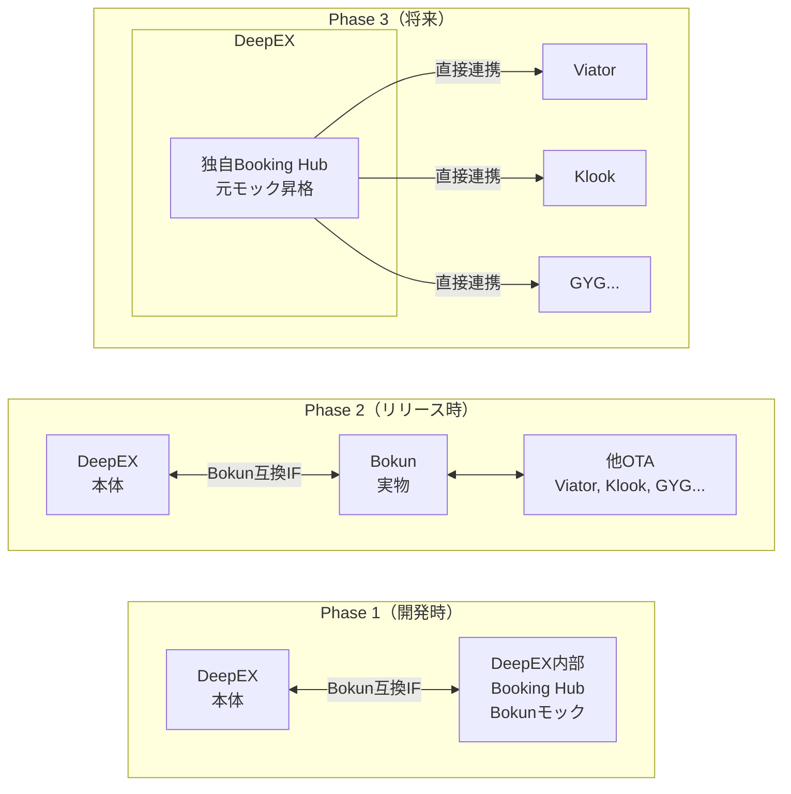

# Bokun連携・OTA Hub設計

## 1. 概要

DeepExperienceの予約・在庫管理は、JTB BÓKUN（以下Bokun）をハブとして他OTA（Viator, GetYourGuide, Klook等）と連携する。ただし将来的にはDeepEX自体が独自Hubとなり、各OTAと直接接続する構想を持つ。

### システム関係図

```
予約・在庫:  DeepEX ↔ Bokun ↔ 他OTA（Viator, Klook, GYG等）
コンテンツ:  DeepEX ↔ 他OTA（直接配信）
```

### Phase別アーキテクチャ



## 2. Bokunとは

旅行体験（ツアー・アクティビティ）の予約・在庫・流通管理プラットフォーム。

### 主要機能
- 商品（体験）の登録・管理
- 在庫（空き枠）のリアルタイム管理
- 複数OTAへの一元流通
- 予約・キャンセル・変更の自動処理
- チケット発行（QRコード / バイナリ）

### 対応OTA
- **ライブ統合**: Viator, GetYourGuide, Expedia Local Expert
- **マーケットプレイス**: Klook, Airbnb, Tiqets, Civitatis, Headout, TUI Musement 等

### 料金
- Channel Manager API: $199/月（有料プランアドオン）
- マーケットプレイス経由: 1予約あたり1.5%手数料

## 3. Bokun Channel Manager API

DeepEXはBokenの「Channel Manager API」を介して連携する。DeepEX側がプラグインサービスを実装し、Bokenがそれを呼び出す構造（Pull型）。

### 3.1 APIエンドポイント

| パス | メソッド | 説明 | 優先度 |
|------|---------|------|--------|
| `/plugin/definition` | GET | プラグインの能力宣言 | P0 |
| `/product/search` | POST | 商品検索 | P0 |
| `/product/getById` | POST | 商品詳細取得 | P0 |
| `/product/getAvailability` | POST | 空き状況取得 | P0 |
| `/booking/reserve` | POST | 仮予約（枠確保） | P1 |
| `/booking/cancelReserve` | POST | 仮予約取消 | P1 |
| `/booking/confirm` | POST | 予約確定 | P1 |
| `/booking/createAndConfirm` | POST | 予約+確定を同時実行 | P0 |
| `/booking/cancel` | POST | 確定済み予約を取消 | P0 |
| `/booking/amend` | POST | 確定済み予約を修正 | P2 |

### 3.2 予約フロー

```
[2段階] SearchProducts → GetAvailability → CreateReservation → ConfirmBooking
[1段階] SearchProducts → GetAvailability → CreateAndConfirmBooking
[キャンセル] CancelBooking（確定後）/ CancelReservation（仮予約中）
```

### 3.3 認証・セキュリティ
- Basic認証（username/password）
- TLS/SSL（自己署名証明書も可）
- IPホワイトリスト
- レートリミット: 400リクエスト/分（同一ベンダー）

### 3.4 テスト環境

| 環境 | URL |
|------|-----|
| 本番 | `https://api.bokun.io` |
| テスト | `https://api.bokuntest.com` |
| APIドキュメント (v1) | `https://api-docs.bokun.dev/rest-v1` |
| APIドキュメント (v2) | `https://api-docs.bokun.dev/rest-v2` |
| YAML定義 | `https://api-docs.bokun.dev/rest-v1.yaml` |
| Swagger定義 | `https://github.com/Bokun/inventory_api` |

## 4. データモデル

### 4.1 ProductDescription（商品）

| フィールド | 型 | 必須 | 説明 |
|---|---|---|---|
| id | string | ✓ | リモートシステムの商品ID |
| name | string | ✓ | 商品名 |
| description | string | | 商品説明 |
| bookingType | enum | ✓ | `DATE` / `DATE_AND_TIME` / `PASS` |
| productCategory | enum | ✓ | `ACTIVITIES` / `ACCOMMODATION` 等 |
| pricingCategories | array | ✓ | 料金カテゴリ（大人/子供等） |
| rates | array | ✓ | 料金プラン |
| ticketSupport | enum | ✓ | `PER_PERSON` / `PER_BOOKING` / `NOT_REQUIRED` |
| meetingType | enum | ✓ | `MEET_ON_LOCATION` / `PICK_UP` 等 |
| startTimes | array | | 開始時刻リスト `{hour, minute}` |
| extras | array | | オプション商品 |
| pickupPlaces | array | | ピックアップ場所 |
| dropoffPlaces | array | | ドロップオフ場所 |
| enforcedLeadPassengerFields | array | | 代表者必須項目 |
| enforcedTravellerFields | array | | 旅行者必須項目 |

#### PricingCategory（料金カテゴリ）
```json
{
  "id": "string",
  "label": "string",       // 例: "大人", "子供", "幼児"
  "minAge": "integer",     // optional
  "maxAge": "integer"      // optional
}
```

#### Rate（料金プラン）
```json
{
  "id": "string",
  "label": "string"        // 例: "通常料金", "早割"
}
```

### 4.2 Availability（在庫・空き状況）

```json
{
  "capacity": 10,                          // 残り席数
  "date": {"year": 2026, "month": 3, "day": 20},
  "time": {"hour": 10, "minute": 0},
  "rates": [{
    "rateId": "rate-1",
    "pricePerPerson": {
      "pricingCategoryWithPrice": [
        {"pricingCategoryId": "adult", "price": {"currency": "USD", "amount": "50.00"}},
        {"pricingCategoryId": "child", "price": {"currency": "USD", "amount": "25.00"}}
      ]
    }
  }]
}
```

### 4.3 ReservationData（予約データ）

```json
{
  "productId": "tour-123",
  "date": {"year": 2026, "month": 3, "day": 20},
  "time": {"hour": 10, "minute": 0},
  "customerContact": {
    "firstName": "John", "lastName": "Doe",
    "email": "john@example.com", "phone": "+81-90-1234-5678",
    "language": "en", "nationality": "US"
  },
  "reservations": [{
    "rateId": "rate-1",
    "passengers": [{
      "pricingCategoryId": "adult",
      "contact": {"firstName": "John", "lastName": "Doe"},
      "pricePerPassenger": {"currency": "USD", "amount": "50.00"}
    }]
  }],
  "bookingSource": {
    "segment": "OTA",
    "bookingChannel": {"id": "deepex", "title": "DeepExperience"}
  }
}
```

### 4.4 ConfirmBookingResponse（予約確定レスポンス）

```json
{
  "successfulBooking": {
    "bookingConfirmationCode": "BK-2026-0001",
    "ticketsPerPassenger": {
      "ticketPerPricingCategory": [{
        "pricingCategory": "adult",
        "ticket": {
          "qrTicket": {"ticketBarcode": "QR-DATA-HERE"}
        }
      }]
    }
  }
}
```

### 4.5 PluginDefinition（プラグイン定義）

```json
{
  "name": "DeepExperience",
  "description": "DeepExperience Tour Booking System",
  "capabilities": [
    "SUPPORTS_AVAILABILITY",
    "SUPPORTS_RESERVATIONS",
    "SUPPORTS_RESERVATION_CANCELLATION"
  ],
  "parameters": []
}
```

## 5. 主要なEnum定義

| Enum | 値 |
|------|-----|
| BookingType | `DATE`, `DATE_AND_TIME`, `PASS` |
| ProductCategory | `ACCOMMODATION`, `ACTIVITIES`, `CAR_RENTALS`, `TRANSPORT` |
| TicketSupport | `TICKET_PER_PERSON`, `TICKET_PER_BOOKING`, `TICKETS_NOT_REQUIRED` |
| MeetingType | `MEET_ON_LOCATION`, `MEET_ON_LOCATION_OR_PICK_UP`, `PICK_UP` |
| SalesSegment | `DIRECT_ONLINE`, `DIRECT_OFFLINE`, `AGENT_AREA`, `MARKETPLACE`, `OTA` |
| ContactField | `GENDER`, `TITLE`, `FIRST_NAME`, `LAST_NAME`, `EMAIL`, `PHONE`, `NATIONALITY`, `DATE_OF_BIRTH`, `PASSPORT_NUMBER`, `PASSPORT_EXPIRY` |

## 6. DeepEXとのギャップ分析

### 現在のDeepEXモデル → Bokun対応に必要な変更

| Bokun概念 | DeepEX現在 | ギャップ | 対応方針 |
|---|---|---|---|
| PricingCategory（大人/子供/幼児） | `pricePerPersonCents`（単一価格） | **大** | PricingCategoryモデル追加 |
| Rate（複数料金プラン） | なし | **大** | Rateモデル追加 |
| BookingType (DATE/DATE_AND_TIME/PASS) | DATE_AND_TIME固定 | 中 | フィールド追加 |
| Capacity（枠単位の在庫） | `maxParticipants` + `currentParticipants` | **合致** | そのまま利用可 |
| TicketSupport（チケット種別） | なし | 中 | Phase 2で対応 |
| MeetingType（集合/ピックアップ） | `meetingPointName`固定 | 小 | enum追加 |
| Extras（オプション商品） | なし | 中 | Phase 2で対応 |
| BookingSource（販売チャネル） | なし | **大** | OTA識別のため必須 |
| Contact（旅行者詳細情報） | `travelerName/Email/Phone`（簡易） | 中 | フィールド拡張 |

### 優先対応（Phase 1）
1. PricingCategory + Rate モデルの追加
2. BookingSource（販売チャネル識別）
3. BookingType フィールド追加

### 後続対応（Phase 2以降）
4. チケット発行機能
5. Extras（オプション商品）
6. ピックアップ/ドロップオフ
7. 旅行者詳細情報（パスポート等）

## 7. 設計方針

### サブシステム分離
- DeepEX本体とBooking Hub間のIFはBokun Channel Manager API互換で設計
- 開発時はモックHubサブシステムで自己完結
- リリース時にモックHub → 実Bokunに切り替え
- 将来的にモックHubを独自Hub化し、OTAと直接接続

### IF設計原則
- Bokun Swagger/Proto定義に準拠したリクエスト/レスポンス形式
- REST（JSON）を採用（gRPCは将来の選択肢として保留）
- 認証はBasic認証 + TLS

## 8. 参考リンク

- [Bokun Developer Documentation](https://bokun.dev/)
- [Inventory API Swagger定義 (GitHub)](https://github.com/Bokun/inventory_api/blob/master/src/main/swagger/inventory_api.json)
- [Plugin API Proto定義 (GitHub)](https://github.com/Bokun/inventory_api/blob/master/src/main/proto_plugin/plugin_api.proto)
- [Common Proto定義 (GitHub)](https://github.com/Bokun/inventory_api/blob/master/src/main/proto_common/common.proto)
- [Channel Manager API ヘルプ](https://docs.bokun.io/en/articles/326-channel-manager-api)
- [OTA連携ヘルプ](https://docs.bokun.io/docs/otas-online-travel-agencies/online-travel-agencies-otas-pro)
- [API Docs UI (REST v1)](https://api-docs.bokun.dev/rest-v1)
- [API Docs UI (REST v2)](https://api-docs.bokun.dev/rest-v2)
- [App Store開発者登録](https://appstore.bokun.io/developer/signup)
- [JTB BÓKUN FAQ](https://www.jtbbokun.jp/faq/jtbbokun/account-dashboard)
