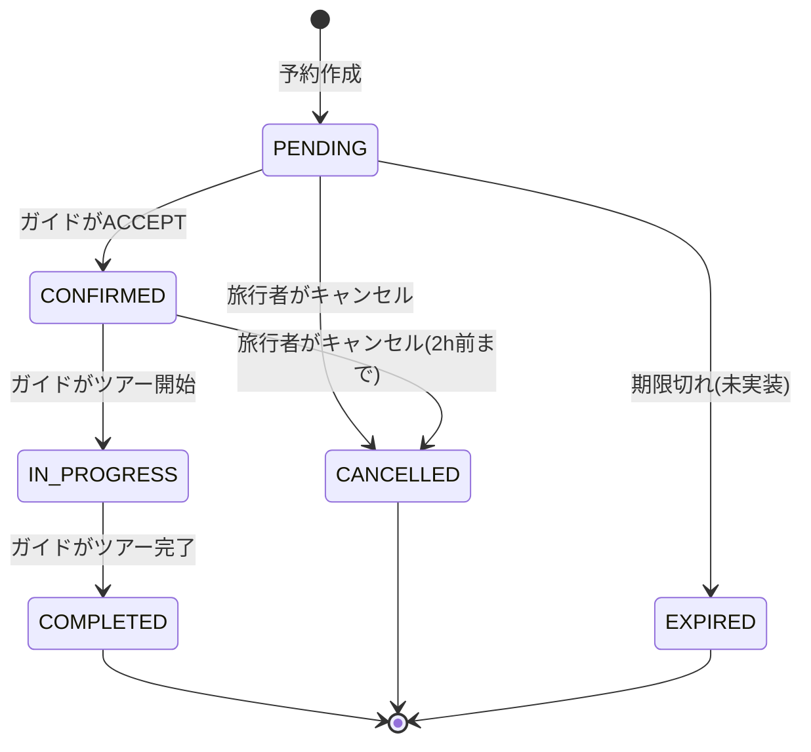
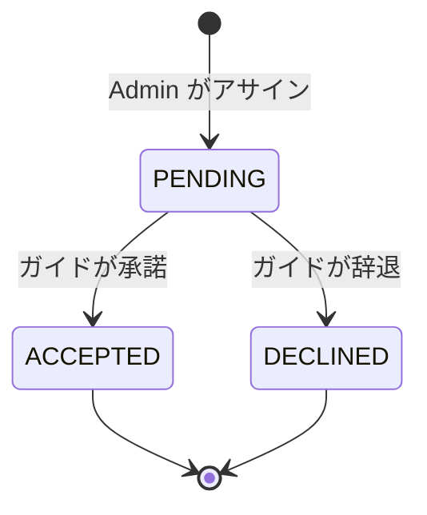
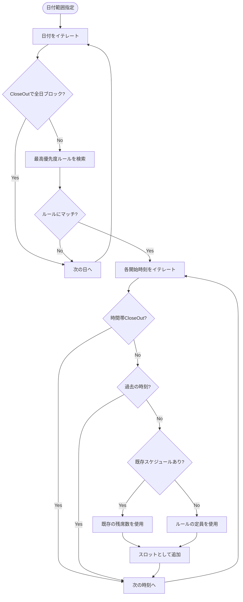
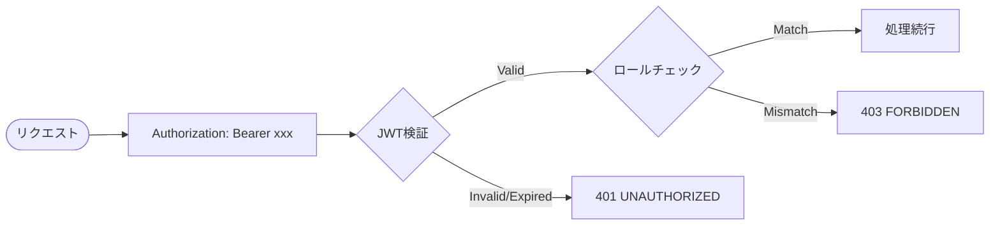
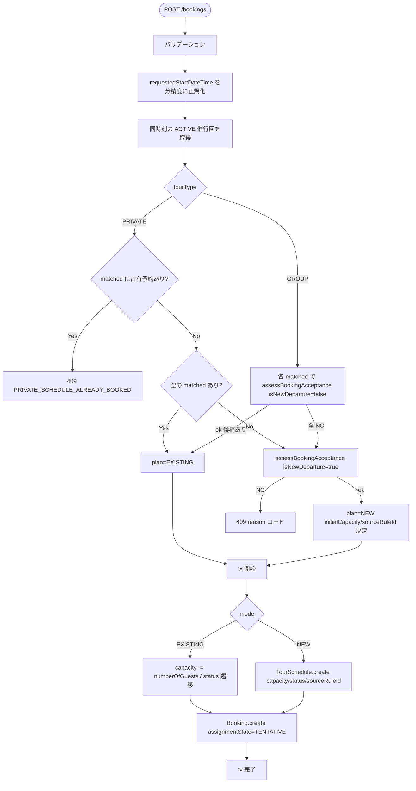
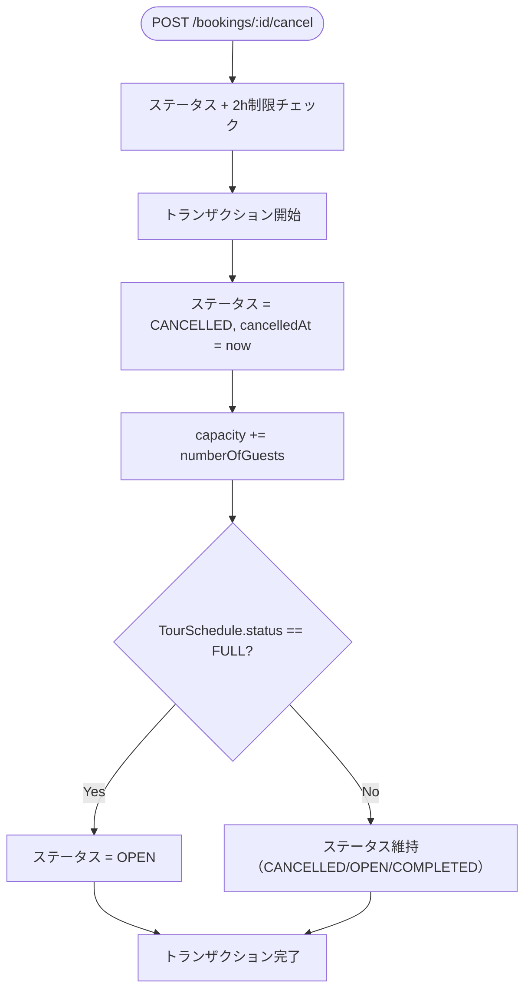
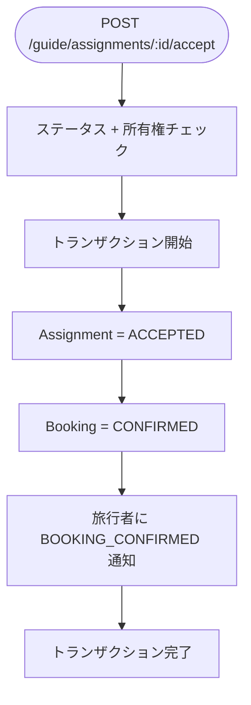
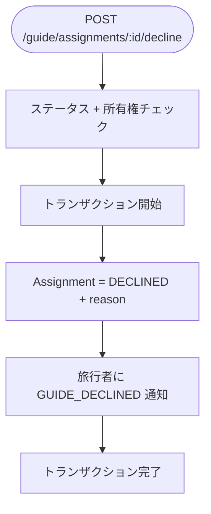
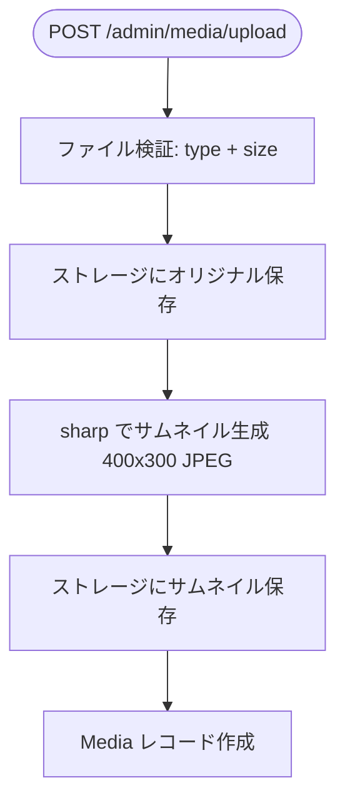
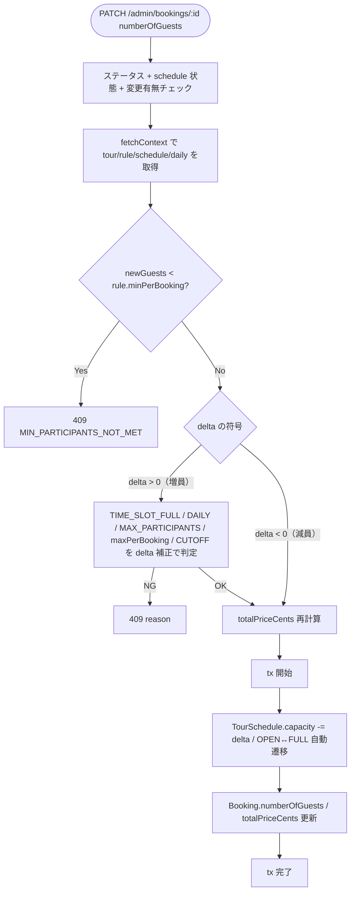

# DeepExperience ビジネスルール

DeepExperienceにおける業務上の不変条件・制約・自動処理をまとめたドキュメント。

## 目次

1. [予約ワークフロー](#1-予約ワークフロー)
2. [ガイドアサインワークフロー](#2-ガイドアサインワークフロー)
3. [空き状況計算](#3-空き状況計算)
4. [認証・認可](#4-認証認可)
5. [メディア管理](#5-メディア管理)
6. [データ整合性](#6-データ整合性)
7. [自動処理・トリガー](#7-自動処理トリガー)

---

## 1. 予約ワークフロー

### 1.1 全体像

### 1.2 予約作成の前提条件

Issue #5 以降、予約作成はクライアントが `tourScheduleId` を指定せず、`tourId + requestedStartDateTime + numberOfGuests` をサーバへ送信する「自動割当」フローになる。サーバは同時刻の既存催行回を探索し、空きがなければ新規催行回を作成する（いずれも `assignmentState=TENTATIVE` で Booking を作成）。

| # | 条件 | チェック層 | エラー |
|---|------|----------|--------|
| 1 | `tourId`, `requestedStartDateTime`, `travelerName`, `travelerEmail`, `numberOfGuests` は必須 | API | 400 VALIDATION_ERROR |
| 2 | `numberOfGuests` は1以上 | API | 400 VALIDATION_ERROR |
| 3 | `requestedStartDateTime` は TZ 付き ISO 8601（末尾 `Z` または `±HH:MM`） | API | 400 VALIDATION_ERROR |
| 4 | 対象ツアーが存在し、`isActive=true` であること | API | 404 NOT_FOUND |
| 5 | PRIVATE ツアーの場合、同時刻に既存催行回と占有予約（OCCUPYING_BOOKING_STATUSES）が同時に存在しないこと | API | 409 PRIVATE_SCHEDULE_ALREADY_BOOKED |
| 6 | CloseOut が該当 JST 日時（または終日）をブロックしていないこと | API | 409 SCHEDULE_CLOSED_OUT |
| 7 | 自動割当の結果、既存催行回への紐付けまたは新規催行回の作成いずれかが成立すること（判定サービス #2 の 6 項目をすべてクリア） | API | 409 `{TIME_SLOT_FULL \| DAILY_CAPACITY_EXCEEDED \| MAX_DEPARTURES_EXCEEDED \| MAX_PARTICIPANTS_EXCEEDED \| MIN_PARTICIPANTS_NOT_MET \| BOOKING_CUTOFF_EXCEEDED}` |
| 8 | 新規催行回作成時、無料キャンセル締切（`startDateTime - Tour.freeCancellationDeadlineHours`）を経過していないこと。既存催行回への追加はこの制約対象外 | API | 409 `DEPARTURE_FINALIZED` |

**トランザクション処理**: 候補探索・判定は tx 外で行い、候補確定後に開く tx 内で「既存催行回の `capacity` 更新」または「新規催行回の作成」と「Booking 作成（`assignmentState=TENTATIVE`）」をアトミックに実行する。

### 1.3 予約キャンセルの前提条件

| # | 条件 | チェック層 | エラー |
|---|------|----------|--------|
| 1 | 予約が存在すること | API | 404 NOT_FOUND |
| 2 | 予約ステータスが `PENDING` または `CONFIRMED` であること | API | 409 CONFLICT |
| 3 | ツアー開始の2時間前までであること | API | 409 CONFLICT "Cannot cancel within 2 hours of tour start" |

**トランザクション処理**: キャンセル時は以下をアトミックに実行:
- 予約ステータスを `CANCELLED` に変更
- `cancelledAt` に現在日時を記録
- スケジュールの残席数（capacity）を `numberOfGuests` 分復元
- スケジュールのステータスを `OPEN` に変更（FULLからの復帰含む）

### 1.4 ツアー開始の前提条件

| # | 条件 | チェック層 | エラー |
|---|------|----------|--------|
| 1 | ガイドとして認証済みであること | API | 401 UNAUTHORIZED |
| 2 | 該当予約に対して `ACCEPTED` ステータスのアサインが存在すること | API | 404 NOT_FOUND |
| 3 | 予約ステータスが `CONFIRMED` であること | API | 409 CONFLICT |

### 1.5 ツアー完了の前提条件

| # | 条件 | チェック層 | エラー |
|---|------|----------|--------|
| 1 | ガイドとして認証済みであること | API | 401 UNAUTHORIZED |
| 2 | 該当予約に対して `ACCEPTED` ステータスのアサインが存在すること | API | 404 NOT_FOUND |
| 3 | 予約ステータスが `IN_PROGRESS` であること | API | 409 CONFLICT |

### 1.6 意図的な仕様

- **EXPIRED遷移は未実装**: ステータス定義にEXPIREDは存在するが、自動期限切れ処理は Phase 0 では実装されていない
- **ゲスト予約**: 旅行者はアカウント不要。メールアドレスのみで予約・検索が可能
- **決済なし**: Phase 0 では現地払い。`totalPriceCents` は計算されるが、オンライン決済は行わない
- **assignmentState の遷移**: Issue #5 で仮割当（`TENTATIVE`）の自動生成、Issue「[運用] 無料キャンセル締切（最終確定）フロー」で `FINALIZED` への自動遷移と再配置禁止を実装済。`POST /bookings/:id/cancel` と `PATCH /admin/bookings/:id`（人数変更）は `assignmentState` に関係なく動作する（§1.3, §1.7 参照）。バッチ仕様は §7.8 を参照。

### 1.7 予約人数変更の前提条件

Issue #6 で導入。管理者が `PATCH /api/v1/admin/bookings/:bookingId` で既存予約の `numberOfGuests` を増減できる。

| # | 条件 | チェック層 | エラー |
|---|------|----------|--------|
| 1 | Admin JWT 認証済みであること | API | 401 UNAUTHORIZED |
| 2 | `numberOfGuests` が1以上の整数であること（その他キーは不可） | API | 400 VALIDATION_ERROR |
| 3 | 予約が存在すること | API | 404 NOT_FOUND |
| 4 | 予約ステータスが `CANCELLED / COMPLETED / IN_PROGRESS / EXPIRED` でないこと | API | 409 BOOKING_NOT_ACTIVE |
| 5 | 紐づくスケジュールが `CANCELLED` でないこと（§7.2.1 不変条件破綻時のフェイルセーフ） | API | 409 BOOKING_NOT_ACTIVE |
| 6 | `newNumberOfGuests !== 現在値` であること | API | 409 GUESTS_UNCHANGED |
| 7 | 増員時、残席・日次上限・ツアー最大人数・`maxPerBooking`・cutoff を判定（#2 判定サービスの項目を delta 補正して再評価） | API | 409 `{TIME_SLOT_FULL \| DAILY_CAPACITY_EXCEEDED \| MAX_PARTICIPANTS_EXCEEDED \| BOOKING_CUTOFF_EXCEEDED}` |
| 8 | 増減に関わらず、`rule.minPerBooking` を下回らないこと | API | 409 MIN_PARTICIPANTS_NOT_MET |

**意図的に適用しない項目**:
- `minParticipants`（催行最小人数）: 減員でこれを下回っても拒否しない。催行可否の判断材料であり、予約変更を拒否する理由にはならない（催行中止は別プロセス）
- `SCHEDULE_CLOSED_OUT` / `MAX_DEPARTURES_EXCEEDED`: 時刻変更なし・新規催行回作成なしの経路のため対象外
- `BOOKING_CUTOFF_EXCEEDED` の減員経路: リソース解放方向なので拒否する合理性がない（増員のみ適用）

**`assignmentState=FINALIZED` の扱い**: 人数変更は**許可する**。FINALIZED は「催行回の再配置不可」を意味し、人数変動は別概念（ゲスト都合の増減は現場で常に発生）。

**`totalPriceCents` の再計算**: 人数変更時に必ず再計算する。単価ソースは「`booking.rateId` + `PricingCategory.isDefault=true` の `RatePrice.priceCents` → 該当なしまたは `rateId=null` の場合は `tour.pricePerPersonCents` に fallback」。`BookingPassenger` 行との整合（年齢カテゴリ別の精緻な合算）は本 Issue のスコープ外。

**トランザクション処理**: tx 内で以下をアトミックに実行:
- `TourSchedule.capacity` を `-delta` 分だけ増減（増員なら減、減員なら増）
- `OPEN ↔ FULL` の自動遷移（§7.2 に準拠、`CANCELLED / COMPLETED` は自動遷移しない）
- `Booking.numberOfGuests` と `Booking.totalPriceCents` を更新

---

## 2. ガイドアサインワークフロー

### 2.1 全体像

### 2.2 アサイン作成の前提条件

| # | 条件 | チェック層 | エラー |
|---|------|----------|--------|
| 1 | Admin JWT 認証済みであること | API | 401 UNAUTHORIZED |
| 2 | `guideId` が必須 | API | 400 VALIDATION_ERROR |
| 3 | 予約が存在すること | API | 404 NOT_FOUND |
| 4 | 予約ステータスが `PENDING` であること | API | 409 CONFLICT |
| 5 | 指定ガイドが存在すること | API | 404 NOT_FOUND |

**注意**: 同一予約に複数のアサインを作成可能（ガイドA辞退→ガイドBアサインの履歴管理）。既存アサインの重複チェックは行わない。

### 2.3 アサイン承諾の前提条件

| # | 条件 | チェック層 | エラー |
|---|------|----------|--------|
| 1 | Guide JWT 認証済みであること | API | 401 UNAUTHORIZED |
| 2 | アサインが存在し、認証ガイド自身のものであること | API | 404 NOT_FOUND |
| 3 | アサインステータスが `PENDING` であること | API | 409 CONFLICT "Assignment already responded" |

**トランザクション処理**: 承諾時は以下をアトミックに実行:
- アサインステータスを `ACCEPTED` に変更 + `respondedAt` 記録
- 予約ステータスを `CONFIRMED` に変更
- 旅行者へ `BOOKING_CONFIRMED` 通知を作成

### 2.4 アサイン辞退の前提条件

| # | 条件 | チェック層 | エラー |
|---|------|----------|--------|
| 1 | Guide JWT 認証済みであること | API | 401 UNAUTHORIZED |
| 2 | アサインが存在し、認証ガイド自身のものであること | API | 404 NOT_FOUND |
| 3 | アサインステータスが `PENDING` であること | API | 409 CONFLICT "Assignment already responded" |

**トランザクション処理**: 辞退時は以下をアトミックに実行:
- アサインステータスを `DECLINED` に変更 + `declineReason` + `respondedAt` 記録
- 旅行者へ `GUIDE_DECLINED` 通知を作成（「別のガイドを探しています」メッセージ）

**注意**: ガイド辞退時に予約ステータスは変更されない（PENDINGのまま）。管理者が別のガイドを再アサインする運用。

### 2.5 意図的な仕様

- **自動マッチングなし**: Phase 0 では管理者が手動でガイドをアサイン
- **ガイドの掛け持ち防止なし**: 同時刻に複数ツアーへのアサインをシステムで防がない（運営が手動管理）
- **辞退理由は任意**: `body.reason` が未指定の場合は `null` で保存

---

## 3. 空き状況計算

### 3.1 計算フロー

### 3.2 CapacityRule マッチングルール

| # | ルール | 条件 | チェック層 |
|---|--------|------|----------|
| 1 | 複数ルールが同一日にマッチする場合、`priority` が最も高いルールのみ使用 | API | `priority DESC` でソート、最初のマッチで `break` |
| 2 | `isActive = false` のルールは無視される | API | Prismaクエリの `where` |
| 3 | WEEKLYルール: `daysOfWeek` 配列に曜日番号（0=日〜6=土）が含まれればマッチ | API | — |
| 4 | RANGEルール: `startDate`〜`endDate` 範囲内かつ `daysOfWeek` マッチ | API | — |
| 5 | SINGLEルール: `singleDate` と年月日が完全一致 | API | — |
| 6 | YEARLYルール: `startDate` の月日と一致（年は無視） | API | — |

### 3.3 CloseOut ルール

| # | ルール | 条件 | チェック層 |
|---|--------|------|----------|
| 1 | `startTime = null` の場合、その日の全時間帯をブロック | API | CloseOutMap で `null` 判定 |
| 2 | `startTime` が指定されている場合、その時間帯のみブロック | API | CloseOutMap の `Set` で判定 |
| 3 | 全日ブロック済みの日に時間帯CloseOutを追加しても効果なし | API | `existing === null` で `continue` |

### 3.4 スケジュール自動生成のルール

`POST /admin/tours/:tourId/schedules/generate` による一括生成:

| # | ルール | 条件 | チェック層 |
|---|--------|------|----------|
| 1 | 既存スケジュールと同一 `startDateTime` のスロットは生成しない | API | `existingSet` で重複チェック |
| 2 | 同一バッチ内でも重複スロットは生成しない | API | 生成したスロットを即 `existingSet` に追加 |
| 3 | `endDateTime` は `startDateTime + durationMinutes` で自動計算 | API | — |
| 4 | `sourceRuleId` に生成元CapacityRuleのIDを記録 | API | — |
| 5 | `createMany` で一括挿入（トランザクションなし） | API | — |

### 3.5 意図的な仕様

- **空き状況APIのデフォルト範囲**: `dateFrom` 未指定時は現在日時から7日間
- **ツアー検索のデフォルト範囲**: `dateFrom` 未指定時は現在日時から3日間（異なる）
- **非アクティブツアーは空き状況を返さない**: `tour.isActive = false` の場合は404
- **過去のスロットは除外**: `slotStart < now` のスロットはスキップ

---

## 4. 認証・認可

### 4.1 認証方式

### 4.2 認証ルール

| # | ルール | 条件 | チェック層 |
|---|--------|------|----------|
| 1 | JWT有効期限は7日間 | API (`auth.ts`) | `jsonwebtoken` の `expiresIn: "7d"` |
| 2 | JWTペイロードには `id`, `email`, `role` が含まれる | API | `JwtPayload` 型 |
| 3 | `JWT_SECRET` 環境変数未設定時はデフォルト値 `dev-secret-change-in-production` を使用 | API | 開発環境用フォールバック |
| 4 | パスワードハッシュは `bcryptjs` を使用 | API | ソルトラウンド10 |

### 4.3 認可ルール

| # | エンドポイント | 必要ロール | チェック層 |
|---|-------------|-----------|----------|
| 1 | `/admin/*` | admin | API (`requireAuth(req, "admin")`) |
| 2 | `/guide/*` | guide | API (`requireAuth(req, "guide")`) |
| 3 | `/tours/*`, `/bookings/*`, `/notifications/*`, `/geocode` | なし（公開） | — |

### 4.4 ガイド所有権チェック

| # | ルール | 条件 | チェック層 |
|---|--------|------|----------|
| 1 | ガイドは自分宛のアサインのみ操作可能 | API | `assignment.guideId !== auth.id` で 404 |
| 2 | ツアー開始/完了は `ACCEPTED` アサインを持つガイドのみ | API | `findFirst({ guideId: auth.id, status: "ACCEPTED" })` |

### 4.5 管理画面クライアント認証

| # | ルール | 条件 | チェック層 |
|---|--------|------|----------|
| 1 | トークンは `localStorage` に `{role}_token` キーで保存 | UI | `client-auth.ts` |
| 2 | API呼び出しで401が返された場合、自動ログアウト+リダイレクト | UI | `authFetch` 内 |

---

## 5. メディア管理

### 5.1 アップロードルール

| # | ルール | 条件 | チェック層 | エラー |
|---|--------|------|----------|--------|
| 1 | 許可MIMEタイプ: `image/jpeg`, `image/png`, `image/webp`, `image/gif` | API | 400 VALIDATION_ERROR |
| 2 | 最大ファイルサイズ: 10MB | API | 400 VALIDATION_ERROR |
| 3 | アップロード時にサムネイルを自動生成（400x300, JPEG, quality=80） | API | — |
| 4 | ファイル名はUUID+タイムスタンプでランダム化 | API | — |

### 5.2 削除ルール

| # | ルール | 条件 | チェック層 | エラー |
|---|--------|------|----------|--------|
| 1 | ツアーまたはスポットに紐付けられたメディアは削除不可 | API | 409 MEDIA_IN_USE |
| 2 | 削除前に紐付け数をチェック（`_count: tourMedia + spotMedia`） | API | — |
| 3 | 削除時にストレージからファイルも削除 | API | `storage.delete()` |

### 5.3 紐付けルール

| # | ルール | 条件 | チェック層 |
|---|--------|------|----------|
| 1 | 同一メディアを同一ツアー/スポットに重複紐付け不可 | DB | `@@unique([tourId, mediaId])` / `@@unique([spotId, mediaId])` |
| 2 | 紐付けには `sortOrder` があり、並び替えが可能 | API | PUT で更新 |

---

## 6. データ整合性

### 6.1 論理削除

| エンティティ | 削除方式 | フィールド | 理由 |
|------------|---------|-----------|------|
| Tour | 論理削除 | `isActive = false` | 予約・スケジュールが参照するため物理削除不可 |
| Spot | 論理削除 | `isActive = false` | ツアーが参照するため物理削除不可 |
| Media | 物理削除 | — | 紐付けなしの場合のみ（ファイルも同時削除） |
| CapacityRule | 物理削除 | — | 削除してもTourScheduleに影響なし（FKリレーションなし） |
| CloseOut | 物理削除 | — | 単純な除外設定 |

### 6.2 カスケード削除

カスケード削除が定義されているリレーション（詳細は `data-model.md` 参照）:

| 親 | 子 | 動作 |
|-----|-----|------|
| Tour | TourMedia | `onDelete: Cascade` |
| Spot | SpotMedia | `onDelete: Cascade` |

その他のリレーションはすべて暗黙の `Restrict`（親削除時にエラー）。

### 6.3 通貨・金額ルール

| # | ルール | 適用範囲 |
|---|--------|---------|
| 1 | 全金額はUSDセント単位で格納（例: $30.00 = 3000） | 全 `*Cents` / `*priceCents` フィールド |
| 2 | API応答では `currency: "USD"` を付与 | ツアー検索・予約作成 |

### 6.4 ツアー検索ルール

| # | ルール | 条件 | チェック層 |
|---|--------|------|----------|
| 1 | `lat`, `lng` は必須 | API | 400 VALIDATION_ERROR |
| 2 | 最大検索半径: 20km（`radiusKm` の上限） | API | `Math.min(input, 20)` |
| 3 | 最大取得件数: 100件（`limit` の上限） | API | `Math.min(input, 100)` |
| 4 | 距離計算はHaversine公式を使用 | API | `haversineKm()` 関数 |
| 5 | 結果は距離の昇順でソート | API | — |
| 6 | `isActive = true` のツアーのみ表示 | API | Prismaクエリの `where` |

---

## 7. 自動処理・トリガー

### 7.1 予約作成時の自動割当と容量更新

Issue #5 以降、`POST /bookings` はサーバ側で候補催行回の探索と必要に応じた新規催行回の作成を行う。

判定チェーン（assessBookingAcceptance）は以下の順で評価され、最初に NG となった理由を返す:

1. SCHEDULE_CLOSED_OUT（CloseOut）
2. TIME_SLOT_FULL（scheduleId 指定時のみ）
3. DAILY_CAPACITY_EXCEEDED
4. MAX_DEPARTURES_EXCEEDED（isNewDeparture=true のみ）
5. MIN_PARTICIPANTS_NOT_MET / MAX_PARTICIPANTS_EXCEEDED
6. BOOKING_CUTOFF_EXCEEDED

### 7.2 予約キャンセル時の容量復元

**注意**: スケジュールステータスは **`FULL` のときのみ自動で `OPEN` に復帰** する。
管理者が手動で `CANCELLED` にしたスケジュールは、予約キャンセルで自動復帰しない
（運営の明示操作を上書きしないため）。`CANCELLED → OPEN` は運営による明示的な
PATCH 操作のみで可能（現時点では該当エンドポイントは未提供）。

### 7.2.1 催行回の手動無効化（管理者のみ）

- エンドポイント: `PATCH /api/v1/admin/schedules/:id` with `{ status: "CANCELLED" }`
- 前提条件（不変条件）: 非CANCELLED予約が **0件** であること。違反時は 409 CONFLICT。
- 不可逆性: 自動で `OPEN` に戻らない（7.2 のガード参照）。

### 7.3 アサイン承諾時の連鎖更新

### 7.4 アサイン辞退時の通知

**注意**: 辞退時に予約ステータスは変更されない。管理者が別のガイドを再アサインするまで `PENDING` のまま。

### 7.5 メディアアップロード時のサムネイル自動生成

### 7.6 通知種別

| 通知タイプ | トリガー | 宛先 | メッセージ |
|-----------|---------|------|-----------|
| `BOOKING_CONFIRMED` | ガイドがアサイン承諾 | 旅行者メール | "Your booking for {tourTitle} has been confirmed!" |
| `GUIDE_DECLINED` | ガイドがアサイン辞退 | 旅行者メール | "We're finding another guide for your booking..." |

### 7.7 予約人数変更時の容量差分反映

Issue #6 で導入。`PATCH /api/v1/admin/bookings/:bookingId` で予約人数が変更された際、紐づく催行回の残席カウンタと `Booking` のサマリをアトミックに同期する。

**判定サービスの delta 補正（重要）**: `fetchContext` の `schedule.remainingCapacity` と `daily.bookedGuests`、`schedule.currentGuests` はいずれも当該予約の「旧人数」を含んだ状態であるため、増員判定では以下のように旧を差し引いてから新を加算する:

| 項目 | 判定式 |
|------|-------|
| TIME_SLOT_FULL | `delta > remainingCapacity` |
| DAILY_CAPACITY_EXCEEDED | `bookedGuests - oldGuests + newGuests > dailyCapacity` |
| MAX_PARTICIPANTS_EXCEEDED（tour全体） | `currentGuests - oldGuests + newGuests > maxParticipants` |
| MAX_PARTICIPANTS_EXCEEDED（rule.maxPerBooking） | `newGuests > maxPerBooking` |
| MIN_PARTICIPANTS_NOT_MET（minPerBooking） | `newGuests < minPerBooking` |
| BOOKING_CUTOFF_EXCEEDED（増員のみ） | `(startDateTime - now) / 60000 < bookingCutoffMinutes` |

減員では上記の上限系は全てスキップ（リソース解放方向）。`minPerBooking` のみ方向によらず適用。

**`OPEN ↔ FULL` 自動遷移**: §7.2 と同じルール。`CANCELLED`（運営意図）と `COMPLETED`（終端）は自動遷移しない。

### 7.8 無料キャンセル締切（FINALIZE）バッチ

無料キャンセル締切時点で、予約の再配置を閉じる。自動割当で新規催行回を生成するパスと、管理者による手動再配置パスの双方を閉じる。既存催行回への新規予約追加は許容する。

#### 前提定義
- 締切時刻 = `TourSchedule.startDateTime - Tour.freeCancellationDeadlineHours`
- `Tour.freeCancellationDeadlineHours === null` は「締切未設定」を意味し、FINALIZE 対象外。バッチ実行時に TENTATIVE のまま残る予約を WARN カウントとしてログ出力する（運営側の設定漏れ検知）。

#### 自動遷移バッチ
- エンドポイント: `POST /api/v1/admin/jobs/finalize-bookings`
- 起動方式: Vercel Cron（頻度 `0 * * * *` = 1時間ごと）。`Authorization: Bearer $CRON_SECRET` を検証
- 対象: `Booking.assignmentState='TENTATIVE'` かつ `Booking.status NOT IN ('CANCELLED','EXPIRED')` かつ `Tour.freeCancellationDeadlineHours IS NOT NULL` かつ現在時刻が締切時刻を経過
- 処理: 対象予約の `assignmentState` を `FINALIZED` に一括更新。`JobExecutionLog` に `jobName='FINALIZE_BOOKINGS'` のレコードを RUNNING→SUCCESS/FAILED で残す
- 実行ログ: `JobExecutionLog.processedCount` に FINALIZE 件数、`warnCount` に null 扱い予約件数、`payload` に対象 bookingId 配列（PII 非含有）

#### on-read 二重防御
バッチ遅延時の不整合を防ぐため、サービス層の以下3箇所で「DB値 + 時刻計算」の両方で判定する:

| 箇所 | 判定 | リジェクト理由 |
|------|------|--------------|
| `resolveScheduleAssignment.planNewSchedule` | 新規催行回作成前に締切経過判定 | `DEPARTURE_FINALIZED` |
| `reassignBookingSchedule` 冒頭 | 既存予約の oldSchedule に対する締切経過判定 | `BOOKING_FINALIZED` |
| `reassignBookingSchedule` NEW target 分岐 | 新規催行回作成前に締切経過判定 | `DEPARTURE_FINALIZED` |

共通の純関数 `isDepartureFinalized({ startDateTime, freeCancellationDeadlineHours, now })` をバッチ/on-read/UI で共有する。`FINALIZE_GUARD_ENABLED=false` で一括無効化可能。

#### FINALIZED 予約の扱い
- 再配置 (`PATCH /api/v1/admin/bookings/:id/assignment`): 禁止（409 `BOOKING_FINALIZED`）
- キャンセル (`POST /bookings/:id/cancel`): 許容（§1.3 参照、2h 前までの通常ルール）
- 人数変更 (`PATCH /api/v1/admin/bookings/:id`): 許容（§1.7 参照）

#### Tour 設定バリデーション
Tour 作成/更新時、`bookingCutoffMinutes > freeCancellationDeadlineHours * 60` となる設定は 400 `VALIDATION_ERROR` で拒否する（予約締切が無料キャンセル締切より後になると FINALIZED 時間帯に新規予約を受け付ける矛盾が生じるため）。両方 null、または片方 null の場合はこのチェックを適用しない。
