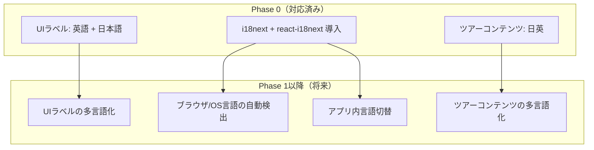

# 多言語対応の方針（Phase 0）

## 基本方針

- **Phase 0のUI言語**: 英語 + 日本語（開発用）
- **ツアーコンテンツ**: 日本語 + 英語（運営が両方登録）
- **将来対応予定**: 中国語（簡体/繁体）、韓国語、タイ語 等

Phase 0では i18next + react-i18next をフレームワークとして導入し、en/ja の翻訳ファイルを用意する。
デフォルト言語はOS/ブラウザの言語設定から自動検出（expo-localization / navigator.languages）。

---

## 対応範囲



---

## 技術選定

| 項目 | 選定 | 理由 |
|------|------|------|
| 翻訳エンジン | i18next + react-i18next | React / React Native 共通で使える定番ライブラリ |
| モバイル言語検出 | expo-localization | OS言語設定の自動検出（Expo Go対応） |
| Web言語検出 | navigator.languages | ブラウザの言語設定から自動検出 |
| 共有パッケージ | @deep-experience/i18n | モノレポ内の共有パッケージとして翻訳リソースを一元管理 |

### ディレクトリ構成

```
packages/
  i18n/
    src/
      index.ts     ← i18next初期化・共通設定
      native.ts    ← React Native向け（expo-localization連携）
      web.ts       ← Web向け（localStorage + ブラウザ言語検出）
    locales/
      en/
        common.json  ← 共通テキスト（ステータスラベル等）
        mobile.json  ← モバイルアプリ固有テキスト
        admin.json   ← 管理画面固有テキスト
      ja/
        common.json
        mobile.json
        admin.json
    package.json
    tsconfig.json
```

### 初期化方法

**モバイルアプリ（React Native）:**
```typescript
import { initI18nNative } from "@deep-experience/i18n/native";

// アプリ起動時に1回呼び出し
initI18nNative();
```

**管理画面（Next.js）:**
```typescript
import { initI18nWeb } from "@deep-experience/i18n/web";

// モジュール読み込み時に1回呼び出し
initI18nWeb();
```

### コンポーネントでの使用

```typescript
import { useTranslation } from "react-i18next";

function MyComponent() {
  const { t } = useTranslation("mobile"); // ネームスペース指定
  const { t: tc } = useTranslation("common");

  return (
    <Text>{t("tour.requestBooking")}</Text>  // → "予約をリクエスト"
    <Text>{tc("status.confirmed")}</Text>     // → "確定済み"
    <Text>{t("map.spotsLeft", { count: 3 })}</Text> // → "残り3枠"
  );
}
```

### 翻訳ファイルの形式（i18next標準）

```json
{
  "map": {
    "searchPlaceholder": "Search: Tokyo Station, Asakusa, Shibuya, or lat,lng",
    "noToursNearby": "No tours found nearby",
    "tourCount": "{{count}} tours",
    "spotsLeft": "{{count}} spots left"
  },
  "tour": {
    "requestBooking": "Request Booking",
    "total": "Total: ${{amount}} (pay on-site)"
  },
  "booking": {
    "guestCount": "{{count}} guest",
    "guestCount_other": "{{count}} guests"
  }
}
```

- **補間**: `{{variable}}` 形式（i18next標準）
- **複数形**: `_other` サフィックス（i18next標準）
- **ネスト**: オブジェクトネスト構造
- **フォールバック**: 該当キーがなければ `en` の翻訳を使用

---

## ネームスペース設計

| ネームスペース | 用途 | 使用箇所 |
|---------------|------|---------|
| `common` | ステータスラベル、共通UI用語 | モバイル・管理画面共通 |
| `mobile` | ツアー検索、予約フロー等 | モバイルアプリのみ |
| `admin` | 予約管理、ツアー管理等 | 管理画面のみ |

---

## 言語切替

### モバイルアプリ
- OS言語設定に連動（expo-localization）
- Phase 0では明示的な言語切替UIは設けない
- Phase 1でアプリ内言語切替UIを追加予定

### 管理画面
- サイドバー下部にja/en切替ボタン
- 選択はlocalStorageに永続化
- `changeLocale()` ヘルパーで切替

---

## ツアーコンテンツの多言語化

Phase 0ではツアーの `title` と `description` を日英で管理する。

### 方針: フィールド分離型

```
Tour
  ├── title       ← メイン言語（日本語）
  ├── titleEn     ← 英語
  ├── description
  └── descriptionEn
```

**Phase 0ではこのシンプルな方式を採用する。**

将来3言語以上に拡張する場合は、JSON型カラムまたは翻訳テーブルに移行する:

```
TourTranslation
  ├── tourId (FK)
  ├── locale ("en", "ja", "zh")
  ├── title
  └── description
```

---

## 口コミ・レビューの翻訳（Phase 1以降）

- ゲストとガイドのやり取りは英語で成立する前提
- フロントに表示する口コミは**事後翻訳**が必要になる可能性あり
  - 例: フランス語の口コミ → 英語に翻訳して表示
- Phase 0ではレビュー機能自体が対象外のため、翻訳も対象外
