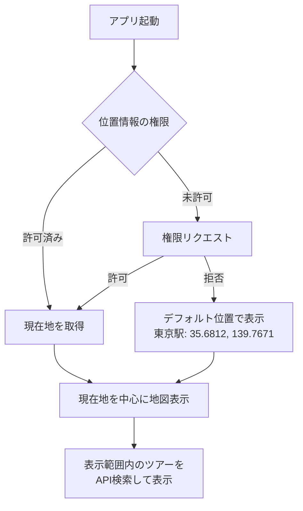
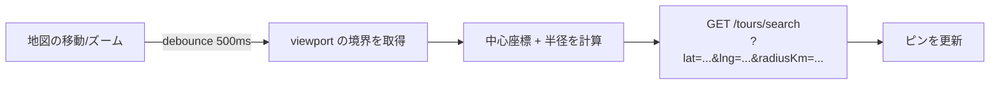
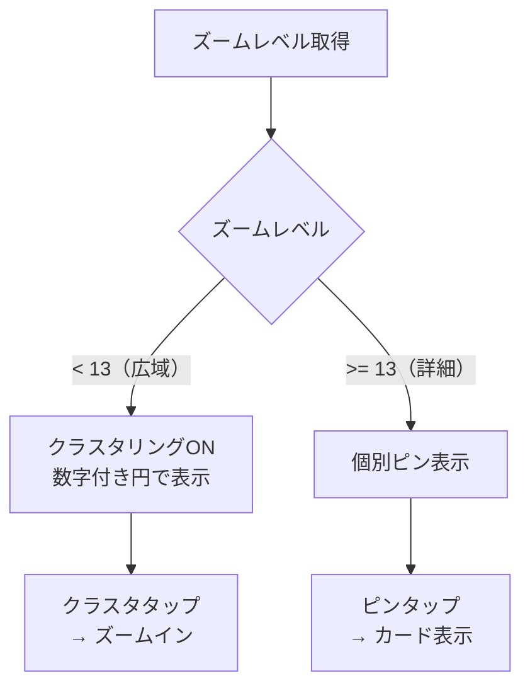
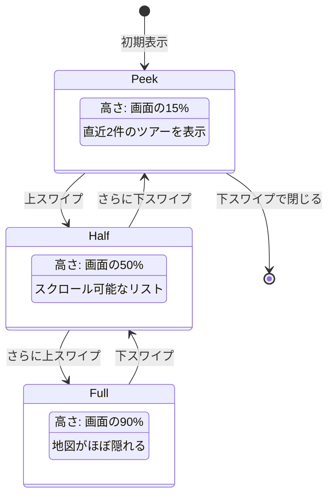

# 地図仕様設計（Phase 0）

## 技術選定

| 項目 | 選定 | 理由 |
|------|------|------|
| 地図SDK | Google Maps SDK (react-native-maps) | iOS/Android両対応、情報量が多い |
| クラスタリング | react-native-map-clustering | 大量ピン対応の定番ライブラリ |
| 位置情報 | expo-location | Expo標準、権限管理が容易 |

---

## 地図表示の基本仕様

### 初期表示



| 設定 | 値 | 説明 |
|------|-----|------|
| 初期ズームレベル | 14 | 約3km四方が見える程度 |
| デフォルト位置 | 東京駅（35.6812, 139.7671） | 位置情報拒否時のフォールバック |
| 最小ズーム | 10 | 市区町村レベル |
| 最大ズーム | 18 | 建物レベル |

### 検索範囲

地図の表示範囲（viewport）に基づいてAPIを呼び出す。



| ルール | 値 |
|-------|-----|
| API呼び出しのdebounce | 500ms（地図操作中は呼ばない） |
| 最大検索半径 | 20km |
| 最小検索半径 | 0.5km |
| 1回の最大取得件数 | 50件 |

---

## ピンの表示ルール

### ピンの種類

| 状態 | 表示 | 色 | 説明 |
|------|------|-----|------|
| 予約可能（OPEN） | 通常ピン | 緑 | 空きあり、予約可能 |
| 残りわずか | 通常ピン | オレンジ | 残り枠が定員の25%以下 |
| 満席（FULL） | 通常ピン | グレー | 定員に達した |
| プライベートツアー | 専用ピン | 青 | プライベートツアー |

### ピンに表示する情報

ピンをタップ前（地図上の表示）:
- カテゴリアイコン（食べ歩き、歴史、自然 等）

ピンをタップ後（カード型プレビュー）:

```
┌─────────────────────────┐
│ [画像]  浅草寺周辺散策ツアー│
│         14:00 | $30.00   │
│         残り3枠 | 歴史    │
│         [詳細を見る →]    │
└─────────────────────────┘
```

---

## クラスタリング仕様



| 設定 | 値 |
|------|-----|
| クラスタリング有効化ズーム | 13未満 |
| クラスタの最小ピン数 | 3（2以下は個別表示） |
| クラスタ半径 | 50px |
| クラスタタップ動作 | そのクラスタ範囲にズームイン |

---

## ボトムシート仕様

地図画面の下部に表示するツアーリスト。



| 状態 | 高さ | 内容 |
|------|------|------|
| Peek（初期） | 画面の15% | 直近2件のツアーをプレビュー |
| Half | 画面の50% | スクロール可能なリスト表示 |
| Full | 画面の90% | フルリスト。地図はほぼ隠れる |

リストの並び順: **開始時刻が近い順**（デフォルト）

---

## 位置情報の取り扱い

### 権限

| OS | 権限レベル | 説明 |
|----|-----------|------|
| iOS | When In Use | アプリ使用中のみ取得 |
| Android | ACCESS_FINE_LOCATION | 精度の高い位置情報 |

- バックグラウンドでの位置情報取得は**不要**（Phase 0）
- 権限拒否時はデフォルト位置（東京駅）で地図表示

### 位置情報の更新

| 設定 | 値 |
|------|-----|
| 更新間隔 | ユーザーが明示的に「現在地」ボタンを押した時のみ |
| 精度 | Balanced（バッテリー消費とのバランス） |

---

## 地図上のUI要素

```
┌──────────────────────────────┐
│ [🔍 検索バー              ]    │
│                              │
│                              │
│         Google Maps          │
│         (ピン表示)            │
│                              │
│                    [📍]      │  ← 現在地ボタン（右下）
│                              │
│ ┌──────────────────────────┐ │
│ │  ボトムシート              │ │
│ └──────────────────────────┘ │
│ [🗺 地図]  [📋 リスト]  [📦 予約] │
└──────────────────────────────┘
```

| UI要素 | 位置 | 説明 |
|--------|------|------|
| 検索バー | 上部 | エリア名・カテゴリ入力。タップでフィルタ画面へ |
| 現在地ボタン | 右下 | タップで現在地にパン |
| ボトムシート | 下部 | ツアーリスト。上スワイプで拡大 |
| 下部タブ | 最下部 | 地図 / リスト / 予約 |
