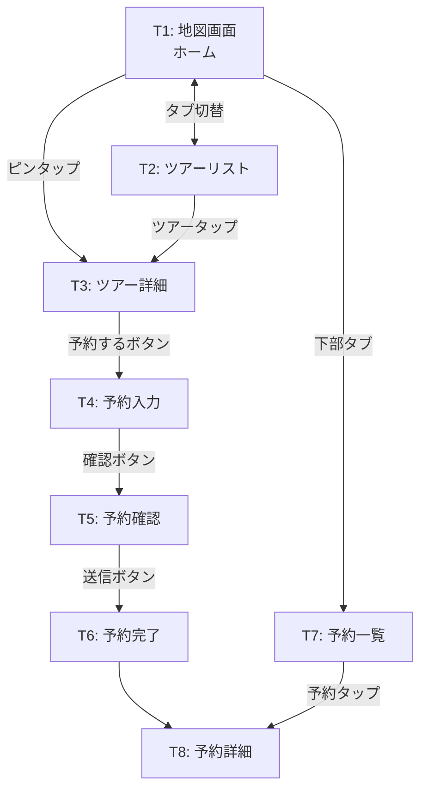
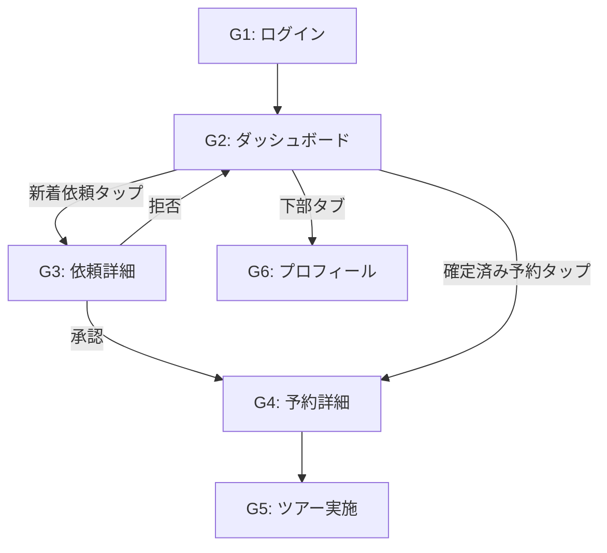
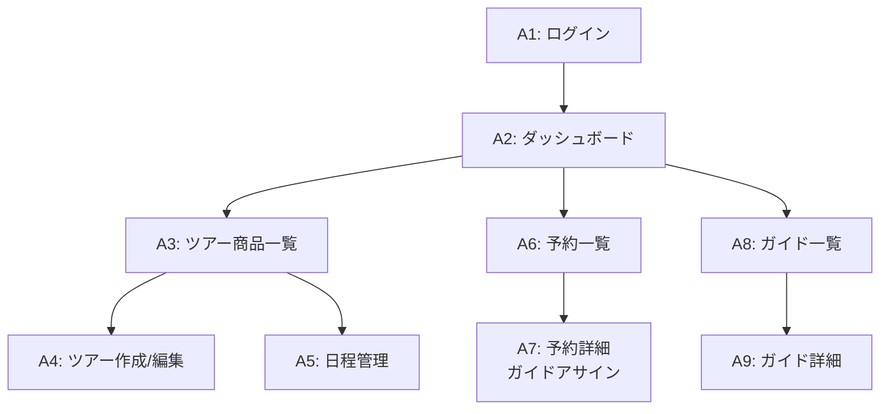
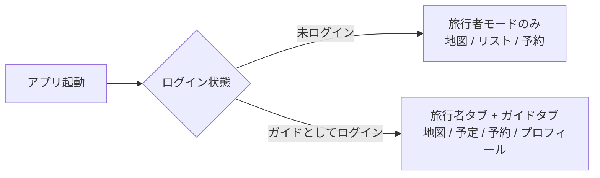

# 画面一覧・画面遷移設計（Phase 0）

---

## アプリ構成

| アプリ | プラットフォーム | 対象ユーザー |
|-------|----------------|------------|
| **モバイルアプリ** | React Native (Expo) | 旅行者 + ガイド（タブで切替 or 別アプリ） |
| **管理画面** | Next.js（Web） | 運営 |

---

## 旅行者向け画面（モバイルアプリ）

### 画面一覧

| # | 画面名 | 説明 |
|---|-------|------|
| T1 | **地図画面（ホーム）** | メインビュー。現在地周辺のツアーピンを表示 |
| T2 | **ツアーリスト画面** | ツアーをリスト形式で表示（地図と切替可能） |
| T3 | **ツアー詳細画面** | ツアーの詳細情報。予約ボタンあり |
| T4 | **予約入力画面** | 参加人数、連絡先、特記事項の入力 |
| T5 | **予約確認画面** | 入力内容の最終確認 |
| T6 | **予約完了画面** | リクエスト送信完了。ステータス表示 |
| T7 | **予約一覧画面** | 自分の予約一覧（メールアドレスで検索） |
| T8 | **予約詳細画面** | 予約のステータス、ガイド情報、集合場所 |

### 画面遷移

### 画面詳細

#### T1: 地図画面（ホーム）

- 上部: 検索バー（エリア・カテゴリで検索）
- 中央: Google Maps（ツアーピンを表示）
- 下部: ボトムシート（直近のツアー一覧をスワイプで表示）
- フッター: 下部タブ（地図 / リスト / 予約）

#### T3: ツアー詳細画面

- ヘッダー: ツアー画像（カルーセル）
- ツアー名
- 日時（開始〜終了）
- 集合場所（名称 + ミニマップ）
- 残り枠 / 最大人数（グループの場合）
- 料金 / person
- カテゴリタグ
- 説明文
- CTAボタン「予約する」

#### T4: 予約入力画面

- ツアー情報サマリ（名称・日時）
- 参加人数（+/- ボタン）
- 連絡先（名前・メール・電話（任意））
- 特記事項（テキストエリア・任意）
- CTAボタン「確認画面へ」

---

## ガイド向け画面（モバイルアプリ）

### 画面一覧

| # | 画面名 | 説明 |
|---|-------|------|
| G1 | **ログイン画面** | メール + パスワード |
| G2 | **ダッシュボード** | 今後のアサイン一覧、新着依頼 |
| G3 | **依頼詳細画面** | ツアー内容、旅行者情報、承認/拒否 |
| G4 | **予約詳細画面** | 確定した予約の詳細。旅行者情報、集合場所 |
| G5 | **ツアー実施画面** | 「開始」「完了」ボタン |
| G6 | **プロフィール画面** | 自分の情報編集 |

### 画面遷移

---

## 運営向け画面（Web管理画面）

### 画面一覧

| # | 画面名 | 説明 |
|---|-------|------|
| A1 | **ログイン画面** | メール + パスワード |
| A2 | **ダッシュボード** | 概要統計、新着リクエスト |
| A3 | **ツアー商品一覧** | 登録済みツアーの一覧 |
| A4 | **ツアー商品作成/編集** | ツアー情報の入力フォーム |
| A5 | **日程管理** | ツアーの日程（スケジュール）を管理 |
| A6 | **予約一覧** | 全予約の一覧。ステータスでフィルタ |
| A7 | **予約詳細・ガイドアサイン** | 予約の詳細。ガイドをアサインする画面 |
| A8 | **ガイド一覧** | 登録済みガイドの一覧 |
| A9 | **ガイド詳細** | ガイドのプロフィール、アサイン履歴 |

### 画面遷移

---

## 旅行者とガイドのアプリ構成

### 方針: 1つのアプリ内で切替

Phase 0では旅行者アプリとガイドアプリを**1つのアプリ**にまとめる。

- デフォルトは旅行者モード（ログイン不要）
- ガイドとしてログインすると、ガイド用タブが表示される
- メリット: 開発コストが半分、ストア審査が1回で済む

---

## 下部タブ構成

### 旅行者モード
| タブ | 画面 |
|------|------|
| 地図 | T1 地図画面 |
| リスト | T2 ツアーリスト |
| 予約 | T7 予約一覧 |

### ガイドモード（ログイン後に追加）
| タブ | 画面 |
|------|------|
| 地図 | T1 地図画面 |
| 予定 | G2 ダッシュボード |
| 予約 | T7 予約一覧 |
| プロフィール | G6 プロフィール |
