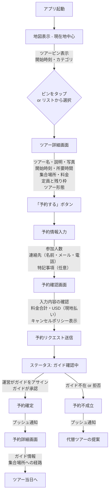
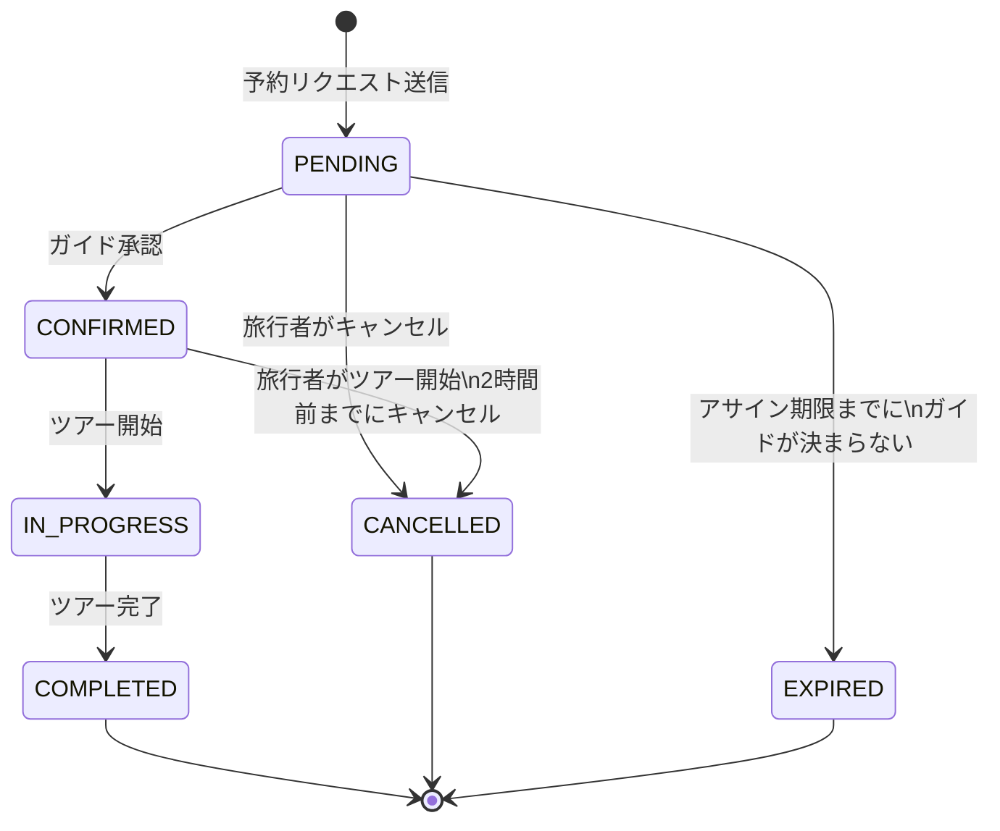
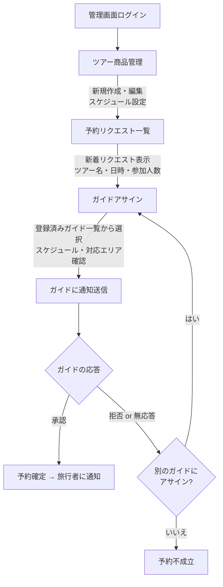
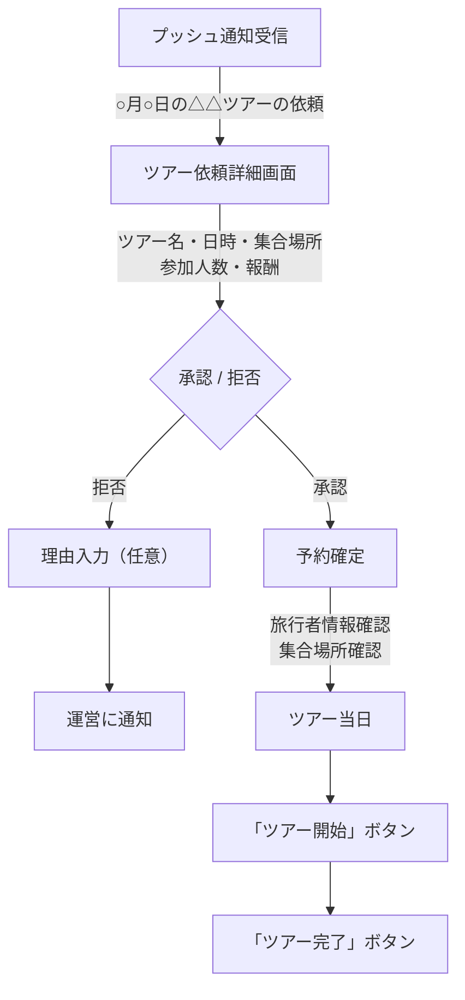

# ユーザーフロー設計（Phase 0）

## 前提条件

- **Phase 0のスコープ**: 直前予約（3日前まで）の成立を検証
- **決済**: Phase 0では含めない（現地払い）。通貨はUSD（ドル）
- **ツアー登録**: 運営（プラットフォーム）が行う
- **ガイドマッチング**: Phase 0では運営が手動アサイン、将来的に自動化
- **ツアー形態**: グループツアー（定員制）とプライベートツアーの両方に対応
- **ガイドアサイン期限**: ツアーにより異なる（Phase 0ではシステム上の決め打ち、具体値はTODO）
- **キャンセル**: ツアー開始の2時間前まで無料キャンセル可
- **旅行者の認証**: アカウント不要（ゲスト予約可）
- **ガイドの認証**: メール + パスワード

---

## 登場人物（アクター）

| アクター | 説明 |
|---------|------|
| **旅行者（Traveler）** | 訪日観光客。ツアーを探して予約する |
| **ガイド（Guide）** | ツアーを実施する人。運営からアサインされる |
| **運営（Admin）** | ツアー商品の企画・登録、ガイドのアサインを行う |

---

## フロー1: 旅行者 — ツアー探索〜予約

### 旅行者の予約ステータス遷移

---

## フロー2: 運営 — ツアー管理・ガイドアサイン

---

## フロー3: ガイド — アサイン受諾〜ツアー実施

---

## Phase 0 で含めるもの / 含めないもの

### 含める（MVP）
- [x] 旅行者: 地図でツアー探索 → 予約リクエスト → 確定通知
- [x] 運営: ツアー登録・管理 → ガイドアサイン
- [x] ガイド: 依頼受信 → 承認/拒否
- [x] 基本的なプッシュ通知（予約確定、ガイドアサイン）
- [x] ツアー形態: グループ（定員制）、プライベート両対応

### 含めない（Phase 1以降）
- [ ] アプリ内決済
- [ ] ガイド自動マッチング
- [ ] ガイド⇔旅行者のアプリ内メッセージ
- [ ] レビュー・評価機能
- [ ] ガイドによるツアー企画・登録
- [ ] 旅行者のお気に入り・閲覧履歴
- [ ] 多言語対応の本格実装（Phase 0は英語ベース）

---

## 決定事項（ビジネスルール）

| ルール | 内容 |
|-------|------|
| **ガイドアサイン期限** | Phase 0ではシステム上の決め打ちとする（TODO: 具体的な時間は要検討）。実運用ではツアーにより異なる（メジャーツアーなら3時間前等）。OTA経由は24時間ルールが一般的、自社システムは比較的ギリギリまでOK |
| **マッチング不成立** | ガイドがアサインできなかったケースはシステム上厳密に考慮する。返金処理が必要（OTA経由の場合はペナルティも発生しうる）。OTAでは24時間以前ならゲストに日付変更を依頼できる救済措置あり |
| **ガイドのドタキャン** | 緊急アサインフロー：現行はLINE・電話で対応。アプリ側は事後でアサイン変更する（可能であればツアー前にゲストへ通知が望ましい） |
| **キャンセルポリシー** | ツアー開始の2時間前までキャンセル可能（無料） |
| **ガイド応答期限** | システム上の期限なし（Phase 0は運営が手動運用で管理） |
| **ガイドの掛け持ち** | 同日時に複数ツアーへの参加表明は可能（実際に実施するのはいずれか1つ。物理的なブッキングはシステム側で防がない） |
| **旅行者の認証** | アカウント不要（ゲスト予約可）。名前・連絡先のみで予約可能 |
| **ガイドの認証** | メール + パスワードで登録・ログイン |
| **ガイドの端末** | スマホメイン（プッシュ通知が必要なため） |
| **運営の認証** | メール + パスワード（管理画面） |
| **通貨** | USD（ドル）。決済はStripeを想定（Phase 0では現地払い） |
| **通知への依存** | 現時点で通知機能は未実装で問題なし。ただしコンセプトに「即時予約（最短60分〜30分以内）」があり強い要望のため、通知周りの設計は重要。海外旅行中のSIMパケット制限等により通知が届かないケースも想定し、通知なしでもUXが成立することを確認する |
